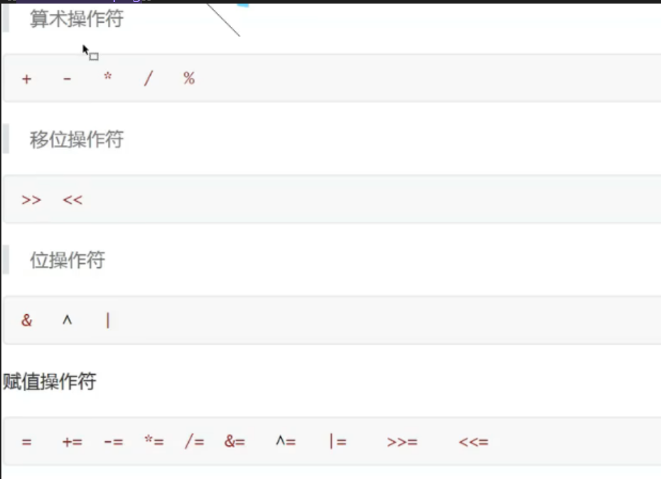
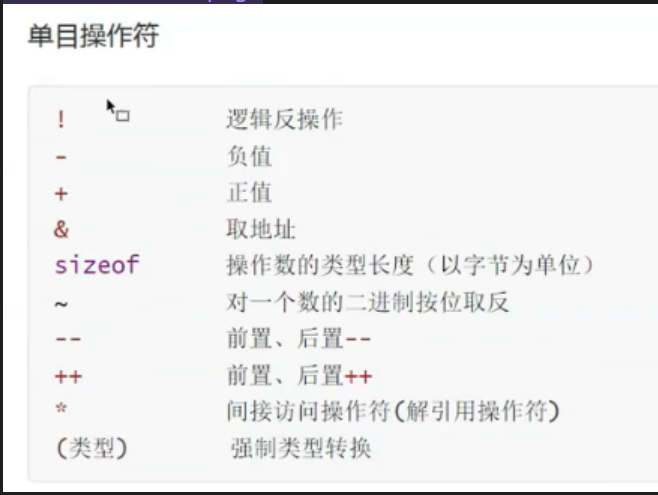
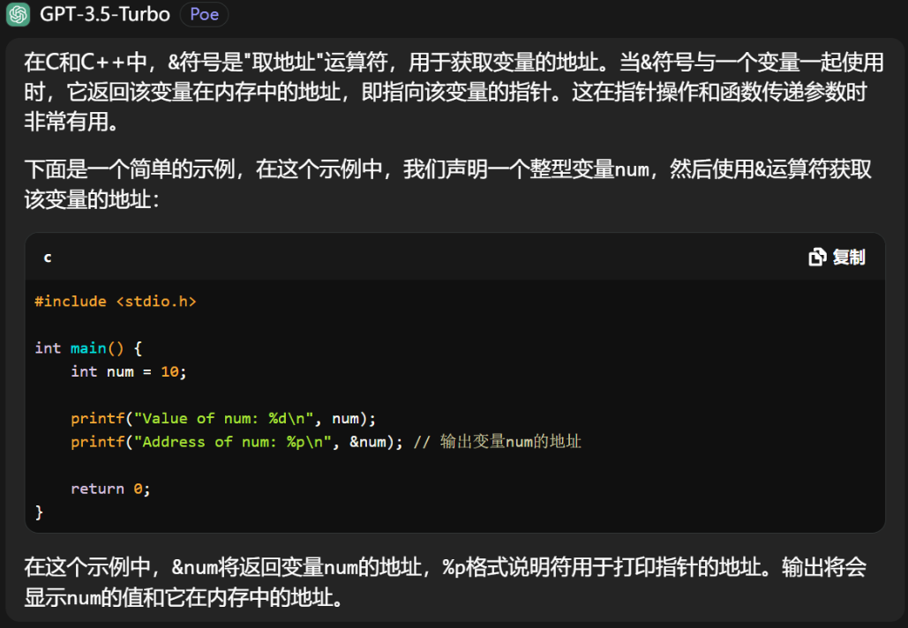

## 运算符

首先需要注意的点：==c语言中0代表假，非0值代表真==

运算符概览，下面只讲解每个运算符需要注意的点



#### 算数运算符
* 除号两端都是整数的时候，执行的是整数除法；
* 如果两端只要有一个浮点数就执行浮点数除法
* c语言取模操作符%两端只能是整数
 ```c
* float a = 7 / 2.0; 
	int b = 7 / 2;  
	int c=  7 % 2.0;  //报错
	printf("%f\n", a); //3.5
	printf("%d\n", b);  //3.0
```

#### 位操作符
* &按位与 ^按位异或  |按位或 <<左移位  >> 右移位 ~按位取反
* 移位操作符对于左移位，右边空位补0即可
* 而对于右移位，  
	1. 如果`x>>n`中x是有符号数，那么左边空位补符号位上的数——算术移位  
	2. 如果x为无符号数，那么左边空位补0——逻辑移位

编程中经常用左移位和右移位代替乘法和除法，左移n位代表乘以2的n次方，右移n位代表除以2的n次方

#### 单目操作符
* ！：逻辑反：把真的变成假假的变成真
* &取地址符：具体讲解如下图所示
  
* ==sizeof是操作符而不是函数，他是一个单目操作符==
* `sizieof()`是用来获取===数据类型或变量在内存中所占的字节数大小===
* 因为上一条，所以他可以用于计算数组的大小
```c
	int arr[10] = { 0 };
	printf("%d\n", sizeof(arr));
	//运算结果40，计算的是整个数组的大小，单位是字节
	printf("%d\n", sizeof(arr)/sizeof(arr[0]));
	//可以用此方法计算数组元素个数
```

#### 自增1自减1操作符
* 下面以自增1为例子讲
* 总结而言：前置++是先++后使用，后置++是先使用后++，具体看下面的例子
1.后置++，先使用后++
```c
int a = 10;
	int b = a++;
	printf("%d\n", b);//10
	printf("%d\a", a);//11
```
2.前置++，先++后使用
```c
int a = 10;
	int b = ++a;
	printf("%d\n", b);//11
	printf("%d\a", a); //11
```

取地址符&，指定了用户输入数据存放的变量的地址
取地址符&和间接访问操作符（解引用操作符）\*的具体讲解在后面的将指针时会讲

#### 逻辑操作符
* 逻辑非：！
* 逻辑与：&&，就是且的意思
* 逻辑或：||，就是或的意思

#### 条件操作符
表达式1 ？ 表达式2：表达式3
* 如果表达式1为真，则整体表达式的值为表达式2
* 如果表达式1为假，则整体表达式的值为表达式3

 
## 强制类型转换
* (类型)就是强制类型转换符，类型就是强制转换的类型
* 字面浮点数如3.1，编译器会默认理解为double类型而不是float类型
  
上例的结果就为3。


## 逗号表达式
* 逗号表达式就是逗号隔开的一串表达式
* 从左向右依次计算，整个表达式的结果是最后一个表达式的结果
* 下例d的结果为5
![[附件/Pasted image 20241023174429.png]]

