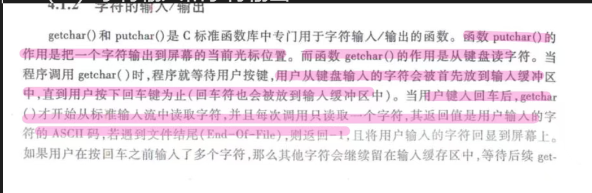
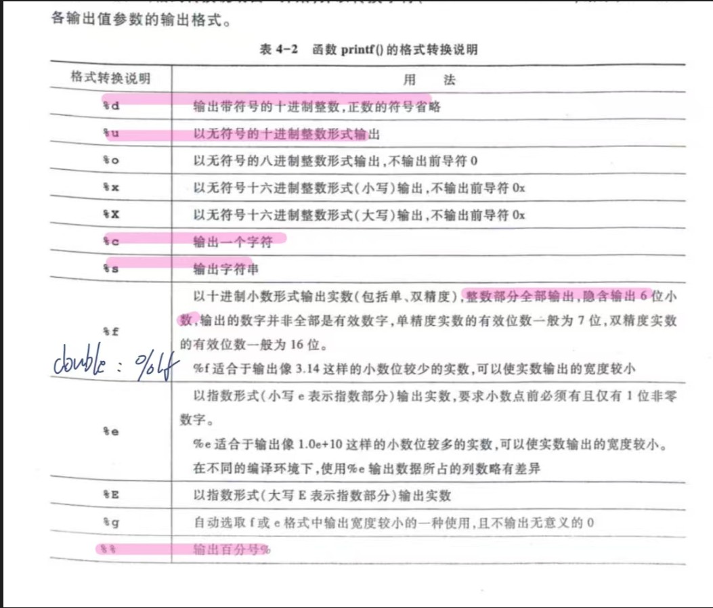
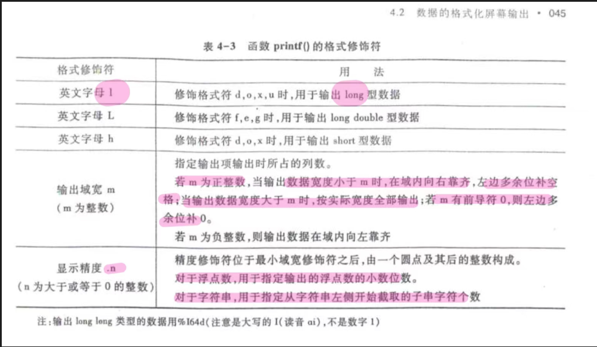

## （一）字符输入和字符输出

* getchar()没有参数，putchar()有参数

## （二）数据的格式化输出
* printf函数的格式化输出的格式转换说明表如下表所示

* 函数printf()的格式修饰符如下表所示
* 
* 注意当在计算域宽时，小数点也占一个字符位置
* 如果数据宽度小于m，那么右对齐并且左侧默认补空格；如果有前导0，那么左侧多余位补0
* 如果数据宽度大于m，则按实际宽度全部输出

## (三）数据的格式化输入
* 格式转换说明和格式修饰符与printf()函数相同，就只多了一个%s用于输入字符串
* 当用scanf()输入数值类型数据时，遇到下面几种情况都认为是数据输入结束
	 （1）遇到空格符，回车符、制表符  
	 （2）达到输入域宽  
	 （3）遇到非法字符输入  
* scanf()的格式转换字符串中存在除格式之外的其他字符，那么这些字符在输入数据时必须从键盘原样输入
* 用%c输入字符时存在的问题：空格和转义字符包括回车都会被当作有效字符读入。
* 对此的解决方法为:
  （1）在每次读入%c之前，用函数getchar()将数据输入时存入缓冲区中的回车符读入  
  （2）每次在%c之前加一个空格，用于将缓冲区中的回车符读入