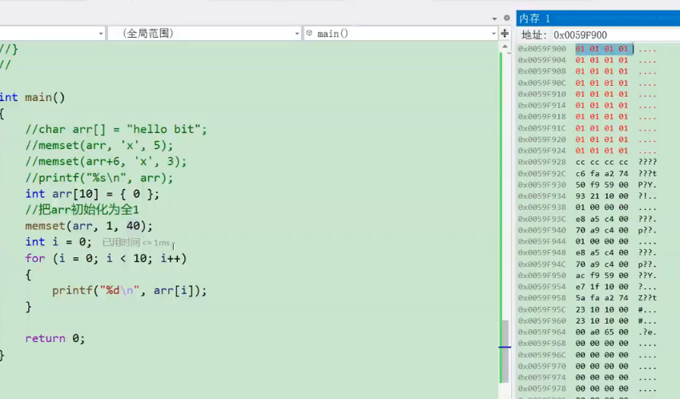
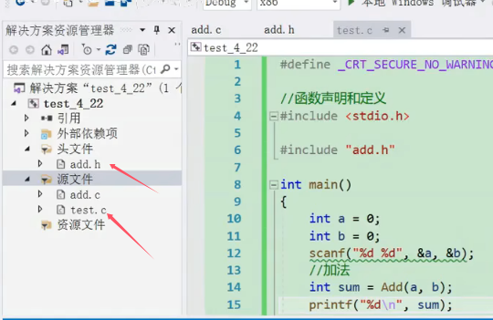

## 函数
#### 1、常用库函数
###### 1）常见函数：memset  

* 函数含义：把ptr位置向后的num个字节的每个字节内容设置成指定的value值。即填充数组内容。
* 需要引头文件<string.h>
* `memset` 通常用于将内存区域初始化为特定值，比如将数组清零或者初始化为某个特定值。
* 注意memset第二个参数是int  类型，也就是说只能设置成某个值，但是不能像memcpy一样直接设置成某一段内容
* **是以字节为单位来初始化的**，并不是以数组元素的单位来初始化的。不然就会出现下图的结果


下图为使用例子

#### 2、自定义函数
###### 1）自定义函数基本结构如下图所示

* 实参：真实传递给函数的参数（常量变量表达式都可以）
* 形参：函数名后括号中的变量，因为形式参数只有在函数被调用的过程中才会被实例化，即分配内存单元。
* 形参当函数调用完成后就自动销毁了，因此形式参数的作用域就是整个函数体
#### 3、传值调用与传址调用
下面举一个基本的swap例子来进行说明

上图为执行swap函数但是是传值调用，那么我们可以看到实参a，b的值确实传过去了，但是实参a、b和形参x，y的地址并不相同。
* 函数调用的时候，实参会传递给形参，函数的形参将会是实参的一份临时拷贝，但是函数形参拥有自己独立的地址空间，所以修改形参不会修改实参。

 
上图为传址调用，这里是将两个标识符的地址传给函数，这样函数可以通过获得的地址，通过解引用操作符可以获得值来进行操作。

问题：什么时候用传值调用，什么时候传地址调用呢？
答：如果在函数体中需要改变传入实参的值，那么就传入的变量的地址；如果只是要用到变量此时的值，那么就传值调用即可。

#### 4、嵌套调用和链式访问
 对于嵌套调用，只需要记得函数可以嵌套访问，但不能嵌套定义即可  

对于链式访问，其定义为把一个函数的返回值作为另一个函数的参数。具体通过下面的一个典型例子来讲解。  

* 首先需要知道printf()的返回值时打印的字符的个数。
* 输出结果为4321的原因：当代码从左右执行的过程中，是将内层printf函数的返回值作为外层printf函数的参数，构成了链式访问。所以需要先执行完内层函数的函数体并且返回一个值，外层函数才会得到这个值并且作为参数来执行，所以会先执行最内层的printf语句打印43；而printf()的返回值时打印的字符的个数，43的字符个数为2，所以第二层的printf会打印出2；相应地最外层的printf会打印出1。

#### 5、函数的声明和定义
1. 函数声明  
		1）告诉编译器有一个函数叫什么，参数是什么，返回值类型是什么，但是是否具体存在，函数声明决定不了   
		2）函数声明一般出现在函数使用之前，满足**先声明后使用**  
		3）函数声明一般都要放在头文件中  
2. 函数定义：就是函数的具体实现，交代函数的功能实现

编译器在扫描一段代码时，他会从上到下依次扫描。如果将被调用函数定义在了调用函数的后面，那么编译器就会报错，正确的的做法是要么将被调用函数定义在调用函数的前面，或者在调用函数执行之前就声明被调用函数。  

具体函数声明和定义的例子如下图所示：  
  

函数声明一般放在头文件中的意思如下图所示，是由上图变换得来




###### 拓展——导入静态库的方法  

`#pragma comment` 是一个用于告诉编译器链接器需要包含特定库的预处理指令。这个指令通常用于告诉编译器在链接时将某个库文件链接到最终的可执行文件中。    
可以将程序编译成静态库，静态库中是函数的具体实现。的然后将此静态库和头文件打包给另一个项目进行使用，这样使得另一个项目只知道函数的接口，就可以调用此程序中的函数，不需要知道内部每个函数的具体实现（未来工作中大概率会用到）  

#### 6.函数递归
* 递归：就是一个过程或者一个函数在其定义或说明中有直接或间接调用自身的一种方法   
* 通常把一个大型复杂·的问题转化为一个与原问题相似的规模较小的问题来求解
* 主要思考方式：**把大事化小**  

递归的两个必要条件：
* ** 存在限制条件，当满足限制条件时，递归不再继续（设置递归函数的出口）**
* **每次递归调用以后越来越接近这个限制条件  **

接下来将通过输入一个无符号整值，打印出它的每一位来进行讲解。  
eg：输入1234，打印1 2 3 4  
递归函数的执行顺序如下图所示   


对于递归函数的写法的经验总结（以上例中的递归函数为例进行总结）： 
1. 首先要明白想要求解此问题的每一步是怎么做的，这个就是递归函数中的主要函数体。
2. 其次递归函数最难写的实际上就是递归的出口，什么时候退出递归这个需要仔细的考量，建议每次书写递归函数时首先写出递归结束的判断语句
3. 对于递归函数的理解，实际上是自身调用自身，你可以把它理解成，这就是一个其他函数，你只是调用它，并·不需要关注其内部实现，只需要知道调用此函数能够起到的作用是是什么即可。例如下图中的`print(num / 10);`假设此时传入的形参n的值是1234，那么此句代码实际上就是在解决将无符号整数123的每一位，然后再打印出最后一位即可，这样就完成递归函数。
4. 递归函数的代码量其实很小，只需要将上面的要点掌握就可以很轻松的写出代码


# 变量的存储类型
存储类型代表编译器为变量分配内存的方式
* 自动变量在动态存储区分配内存
* 静态变量和外部变量是在静态存储区分配内存
* 寄存器变量是在寄存器中分配的
* 动态存储区的变量生存期通常较短，静态存储区的分配内存的变量生存期比较长
#### （一）auto自动变量
* 定义格式：`auto int 变量名`
* ==如果没有指定变量的存储类型，那么其存储类型就缺省为auto==
* 自动变量进入语句块自动申请内存，退出语句块自动释放内存
* 自动变量在定义时不会自动初始化

#### （二）static静态变量
* 定义格式：`static int 变量名`
* 用来修饰局部变量——静态局部变量
* 修饰全局变量——静态全局变量
* 修饰函数——静态函数
###### 1.静态局部变量
* ==静态局部变量在函数结束调用时，系统分配给它的内存并不释放，因为是存储在静态存储区==，即静态变量与程序“共存亡”的
* 以下面这个例子将static静态局部变量
```c
void test() {
	static int a = 1;
	a++;
	printf("%d\n", a);
}

int main() {
	int i = 0;
	while (i < 10) {
		test();
		i++;
	}
	return 0;
}
```
上述代码中，a被static修饰，它是静态变量，静态变量是在静态存储区分配内存的，在一静态存储区分配的内存在程序运行期间不会被释放，所以一旦创建了static静态变量，其生命周期是整个程序运行期间，但是作用域还是对应的{}的内部。
* **所以static修饰局部变量的时候，局部变量出了作用域不销毁的，本质上static修饰局部变量的时候，改变了变量的存储位置**
* **用static修饰，它改变了变量的生命周期，生命周期变长，和程序的生命周期一样**
* 为什么上述代码中函数体每次都会给a进行初始化成1，但是还是会讲a值保留到下一次函数调用
* 答：因为**被static修饰的变量，在编译的时候就已经将变量在静态存储区创建并初始化好了，并且有static修饰的变量的初始化语句是没有对应的汇编语句的，这就说明在编译完成开始执行代码的时候并没有这行这句代码，这句代码已经在编译的时候给其分配了地址，而静态变量的生命周期是整个程序的生命周期，所以它的值可以保存到下一次函数调用。
###### 2.静态全局变量
* 在所有函数外定义的去静态变量，是静态全局变量


###### 3.static修饰函数——静态函数

#### (三)外部变量
* extern修饰外部变量这个具体内容的讲解在[[01数据类型、变量和常量]]
* 外部变量是全局变量
* extern修饰的外部变量是存储的静态存储区的
* 全**局变量和静态变量都存储在静态存储区**，都是在编译的时候就对其分配了地址
* extern只能用于引用其他文件中的非静态全局变量或者函数，但是不能引用静态全局变量和静态函数

#### （四）寄存器变量
* 用register修饰，定义格式：`register int 变量名`
* 寄存器变量是用寄存器存储的变量
* CPU访问内存的操作是很耗时的，使有时对内存的访问无法与指令的执行保持同步，将频繁访问的数据存放在CPU内部的寄存器里，这样CPU对存储器第二遍数据访问，使程序更小更快
* 寄存器的读取速度快，但是内存小造价高。
* 现代编译器能够自动优化程序，将普通变量优化成寄存器变量，并且忽略用户的register指定，所以一般无需特别声明变量为register


