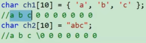

数组是一组相同类型元素的集合  
### 1）一维数组
#### 1.一维数组的创建
* 数组在创建时不能在`[]`中使用变量进行创建，必须是常量表达式，具体创建如下图所示。  

* 在C99之后可以使用变量进行创建，是为了支持变长数组  
 
#### 2.一维数组的初始化
初始化：在创建数组的同时给数组的内容一些初始值。    

下面通过一些例子来讲解初始化的内容
1. 例子1

* 图中第一个为不完全初始化，剩余的部分默认初始化为0    
* 图中第五个和第六个初始化的区别为：用引号初始化的会带有`\0`，第五个不带`\0`。    

2. 例子2：也可以不用在`[]`中进行初始化，编译器会根据`{}`中2初始化内容的个数自动分配数组的大小（注意下图中arr和arr2的区别，以及ch3和ch4的区别）    


#### 3.一维数组的使用
* 下标从0开始，所以有n个元素的数组，下标最多为n-1
* 对与一般数组来说，获取数组长度可以用如下方式计算得到（对于字符串来说，可以通过strlen函数得到字符串长度）  
```c
int length=sizeof(arr)/sizeof(arr[0]);
```
#### 4.一维数组的内存中的存储——数组在内存中是连续存放的


### 2）二维数组
#### 1.二维数组的创建
标准的创建方式如下图所示（先行后列）

#### 2.二维数组的初始化

* 第一个例子是123在第一行，4在第二行的一个，即以此初始化  
* 第二个例子为不完全初始化，第一行前两个为12，第二行前两个位34，说剩下的部分默认初始化为0  
* 第三种初始化：**二维数组初始化行可以省略，列不可以省略**，编译器会自动推算行数，并且给剩下没有初始化的部分初始化为0。  
#### 3.二维数组的使用
 * 行列的下标都是从0开始

* 二维数组的遍历，二维数组可以理解为一维数组的数组
```c
int row=sizeof(arr)/sizeof(arr[0]);
int col = sizeof(arr[0])/sizeof(arr[0][0]);
for(int i=0;i<row;i++){
	for(int j=0;j<col;j++)
		printf("%d",arr[i][j]);
}
```
#### 4.二维数组在内存中的存储

* 从上图中可以看出，二维数组在内存中依然是连续存储  的，也就是如下图所示


### 3)数组作为函数参数
以冒泡排序为例子进行叙述
* 数组传参的时候，形参有两种写法  
	1）数组 `int arr[] `   
	2）指针   `int * arr`   
两种代码的区别以及冒泡排序的完整代码如下图所示  
```c
//形参是数组形式
void bubble_sort(int arr[],int len){
	for (int i =0; i < len - 1; i++) {
		for (int j = 0; j < len - 1 - i; j++) {
			if (arr[j] > arr[j + 1]) {
				int tmp = arr[j];
				arr[j] = arr[j + 1];
				arr[j + 1] = tmp;
			}
		}
	}
}

```
```c
//形参是指针形式
void bubble_sort(int* arr,int len){
	for (int i =0; i < len - 1; i++) {
		for (int j = 0; j < len - 1 - i; j++) {
			if (arr[j] > arr[j + 1]) {
				int tmp = arr[j];
				arr[j] = arr[j + 1];
				arr[j + 1] = tmp;
			}
		}
	}
}
```
典型错例：

* 数组名本质上是数组首元素的地址，而实参传入的是`arr`,所以在排序函数中的形参看似`arr[]`**看似是数组，本质上是指针变量**  
* 如果在函数内部使用`len = sizeof(arr) / sizeof(arr[0]);`求数组长度，这样求出来的结果为1或者2都有可能（指针变量可能为4字节或者8字节），这样就会使结果错误。  
* 正确的做法就像上面代码一样，在函数外部求出数组长度，并将其作为函数参数进行传递。  
### 4）数组名的含义
1. **数组名确实本质上首元素地址，但是有两个例外：**
2. **sizeof(数组名)，这里的数组名表示整个数组，计算的是整个数组的大小，单位是字节
3. **&数组名，这里的数组名表示整个数组，取出的是整个数组的地址**

* **arr和&arr虽然值一样，但是表示不同的含义。**
* arr+1就指向的是数组第二个元素的地址，而&arr+1就直接指向整个数组之后的地址。
* **不论是一位数组还是二维数组，数组名永远本质上是首元素的地址**，不过在一维数组中，数组名表示第一个元素的地址，而二维数组中，数组名表示第一行的地址（把二维数组想象成一维数组的数组）
