* 指针就是用于存放变量的地址，即指针就是地址
* **存放地址（指针）的变量就叫做指针变量**
### 1)指针初阶
#### 指针入门
对于下面这一段代码进行深度刨析
```c
	int a = 10;
	printf("%p\n", &a);
	int* p = &a;//p就是指针变量，类型是int*
	*p = 20;
	printf("%d\n", a);
```

1.首先一个简单的赋值语句的含义
```c
int a=10; //向内存申请4个字节，存储10
&a;//取地址操作符
printf("%p\n", &a);
```
* 地址是以字节为单位
* 像上例中，给a分配了4个字节，那么a的地址是第一个字节的地址
* ==%p是以地址的格式来打印数据，专门用于打印地址==

```c
int* p = &a;//p就是指针变量，类型是int*
```
2.对于这句话的解释：  
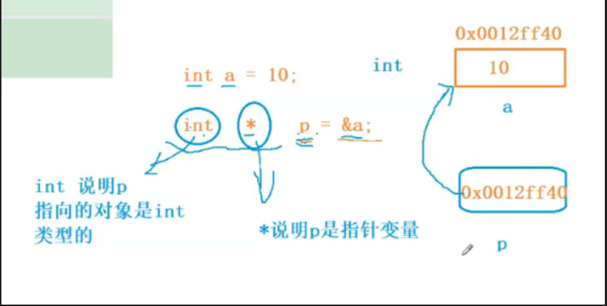

```c
*p=20;//解引用操作符
```
* ==解引用操作符*，意思就是通过p中存放的地址，找到p所指向的对象，\*p就是p指向的对象==
* 对于上例，p存放的是a的地址，\*p就是p指向的对象a，\*p=20代表给a赋值20，所以此时打印出来a的值就是20.
* 口头上指针变量也会被称为指针，比如我们会说p是一个指针，这里的指针指的是指针变量的意思\

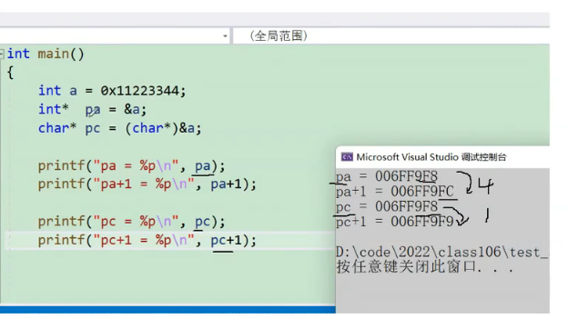  
* 指针类型决定了指针在被解引用的时候访问几个字节。如果是int\*的指针，解引用时访问4个字节；如果是char\*的指针，解引用访问1个字节
* 指针的类型决定了指针+1-1操作的时候，跳过几个字节·，也就是决定了指针的步长
***
#### 指针变量的大小
```c
	printf("%d\n", sizeof(char*));
	printf("%d\n", sizeof(int*));
	printf("%d\n", sizeof(short*));
	printf("%d\n", sizeof(float*));
	printf("%d\n", sizeof(double*));
	//结果全为4或全为8
```
* 不管什么类型的指针，都是在创建指针变量
* 而指针变量是用来存放变量地址的
* 所以地址的大小决定了指针变量的大小
* 那么对于32位机器上的地址：用32bit位去存储，8字节，那么指针变量的大小就是4字节
* 64位机器上的地址：用64bit位去存储，也就是8字节，所以指针变量的大小是8个字节
 ***
 
#### 指针变量的定义与初始化
易错点：对多个相同类型的指针变量的定义
```c
int* pa,pb,pc;
int *pa,*pb,*pc;
```
* 对与第一行，是定义了一个指向整型变量的指针变量pa和整型变量pb，pc
* 而对于第二行才是正确的定义了三个指向整型变量的指针变量pa、pb、pc

易错点：形成野指针（指针指向位置不可知的）  
野指针成因
1. 指针未初始化  
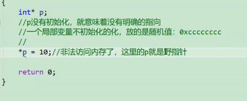  
图中未对指针p初始化，就对p进行解引用，非法访问内存

2. 指针越界访问  
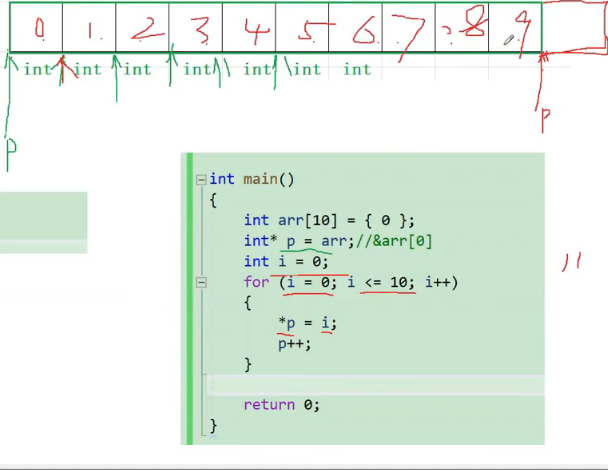    
* 当指针指向的范围超过数组arr的范围，p就是野指针

3. 指针指向的空间释放（开辟动态内存时遇到）  
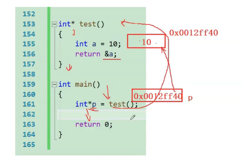  
* 当`test（）`函数执行完时，a由于是局部变量，其空间已经释放，所以p虽然虽然可以记录a的地址，在拿到a的地址时，a变量的内存已经释放，所以造成p为野指针
****

#### 指针运算
##### 1.指针+-整数
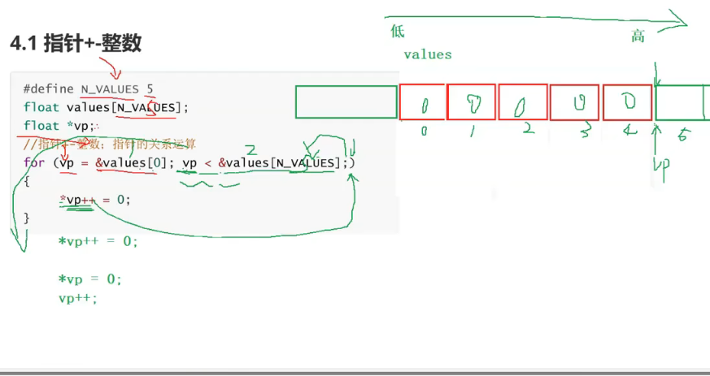  
* **指针的+-整数运算，以++为例子，相当于将指针指向的位置移动到下一个元素的位置**
* 虽然++比\*的优先级要高，但是后置++，所以会先执行解引用和赋值语句的操作，在进行++
* `*vp++`和`(*vp)++`有很大的不同，`*vp++`是作用于vp，是对地址++；`(*vp)++`，作用于`*vp`，是对vp指向的值进行++

##### 2.指针-指针
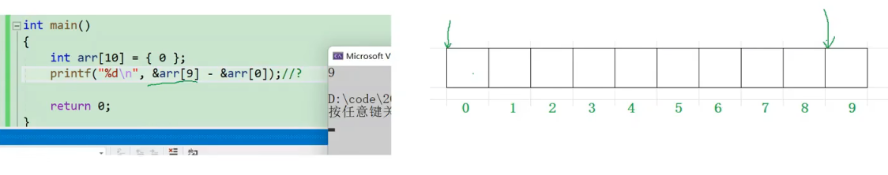  
* 指针-指针的绝对值得到的是指针和指针之间元素的个数
* 上图中如果变为`&arr[0]-&ar[9]`，那么结果将变为-9
注意：不是所有的指针都能相减，指向同一块空间的两个指针才能相减

****
#### 指针和数组
可以通过指针来访问一个数组  
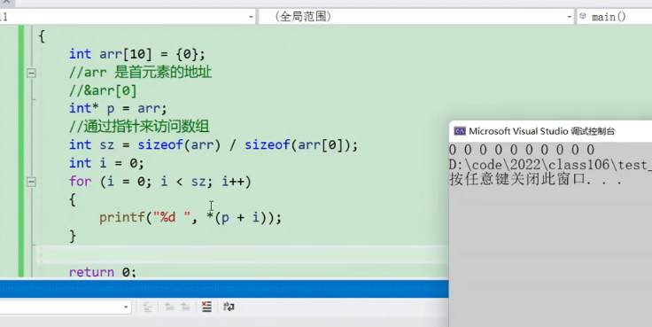  
* 因为数组名就是首元素地址，而数组就是一个相同类型元素·的集合，在物理方面地址连续，所以可以将其赋值给指针，然后就可以通过指针来访问数组。

所以下面三个代码是等价的  
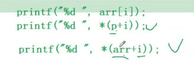  

#### 二级指针
二级指针的图解  
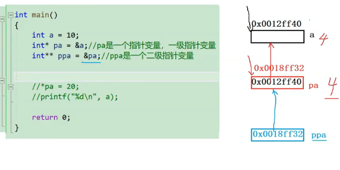  
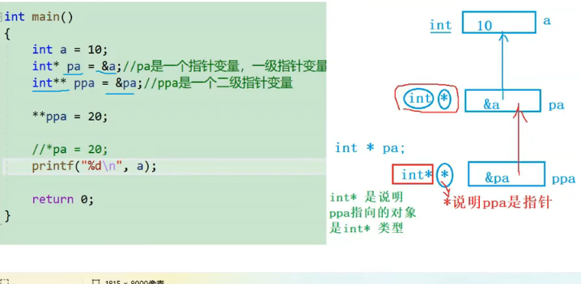  
* 想对使用ppa进行解引用改变a的值，需要进行解引用了两次
* 二级指针变量用来存放一级指针变量的地址

****


### 2）指针进阶

#### 1.字符指针
字符指针不仅是指向字符的指针，他还有以下用法  
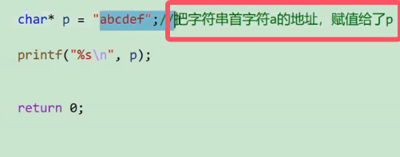  
* **图中使用字符指针的**`abcdef`**是常量字符串，一旦出现，就不能被修改**
* 如果想要使用可以被修改的字符串，此时就用字符数组  
* 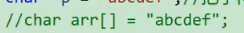  

易错点：分析常量字符串  
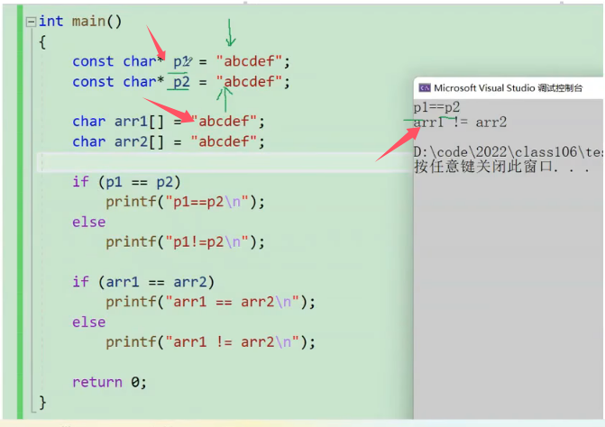  
* 图中是数组名直接开始比较，相当于比较数组首元素地址是否相同，指针比较实在比较两个·字符串的首字符地址是否相同
* **常量字符串是放在内存的只读区域的，不能被更改，内存中只存在一份**，所以第一个输出的是等于
* 第二个不相同的原因是创建了两个数组，也就是创建的两个独立空间，所以地址肯定不会一样，也就是数组首元素地址肯定不一样

#### 2.指针数组
定义：存放指针的数组就是指针数组  
**指针数组是数组而不是指针**，具体图解如下图所示  
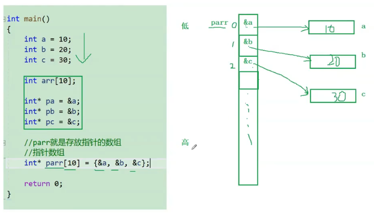  

**重点：可以用指针数组来模拟一个二维数组**
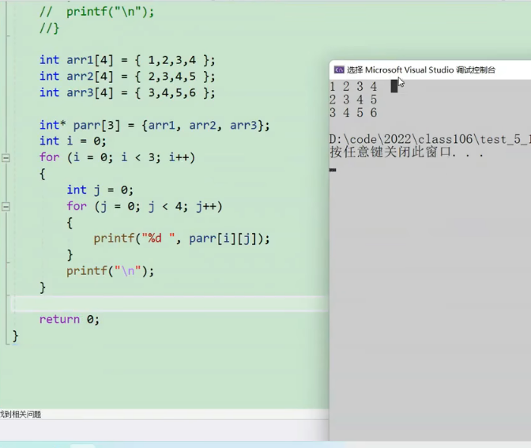      
* `[]`相当于解引用，即`arr[i]`等价于`*(arr+i)`，所以parr\[i]\[j]相当于`*(par[i]+j)`，
