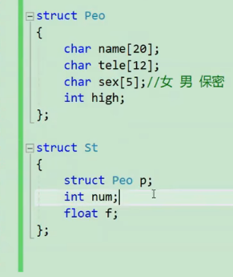
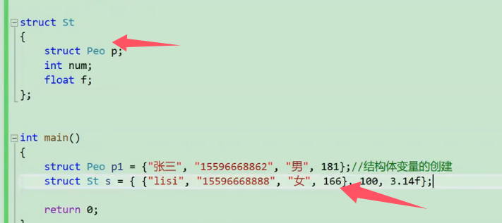
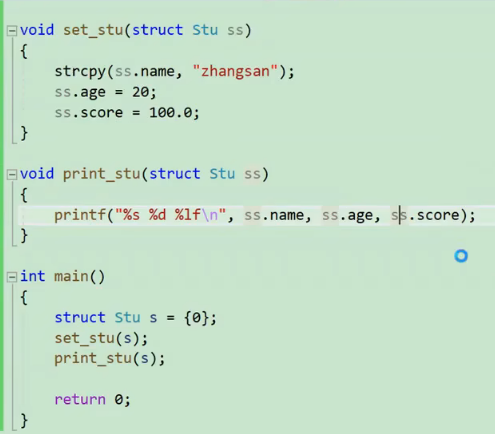
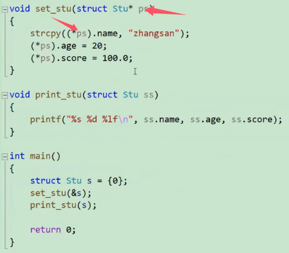
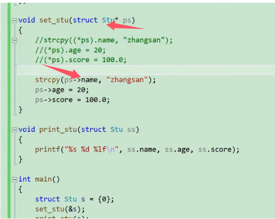
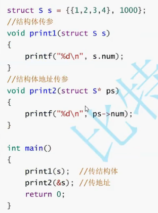
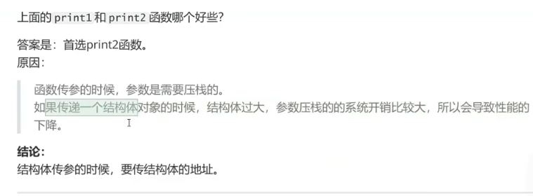

### 1）结构体的定义和初始化
#### 1.结构体的定义
以创建一个学生的结构体为例，来了解结构体的定义格式
```c
//学生
struct Stu{
	//成员变量
	char name[20];
	int age;
	char sex[10];
	char tele[12]
};
```
* 这样相当于就创建了一个自定义变量类型struct Stu
* 那么就可以创建这个类型的变量，eg：struct Stu s;
* s就是一个结构体变量
***
#### 结构体变量的初始化
```c
struct Stu s = { "zhanfsan",20,"nan","15555555665" };
```
* 结构体变量也可以进行不完全初始化，剩下的部分也是默认为对应类型的0.

### 2）关键字typedef
定义：就是类型定义，用于给类型重命名
```c
///用typedef给struct node 重命名为Node，即Node也是一个类型名
typedef struct node {
	int data;
	struct Node* next;
}Node;

int main() {
	//a和b的数据类型是一样的
	struct node a;
	Node b;
	return 0;

```


### 3） 嵌套的结构体和结构体的引用
#### 1.嵌套的结构体
结构体里面可以包含其他结构体的结构体变量  
  
##### 嵌套结构体的初始化  
  


#### 2.结构体的引用
以下面代码为例讲解结构体的引用
```c
struct Stu s = { "zhanfsan",20,"nan","15555555665" };
printf("%s %d %s %s",s.name,s.age,s.sex,s.tele);
```
* 结构体对象访问他的成员，用的是'.'，
* **’.‘是成员选择操作符**，**访问格式：结构体变量名.成员名**


### 4） 结构体成员操作符
对应于结构体变量，其操作符为`.`；对应于结构体指针，其操作符为`->`。    
  
* 注意结构体中的成员如果是数组，不能直接使用ss.name，因为name代表数组首地址，并不代表整个数组，所以对于结构体中有数组的情况，对其值进行改变需要使用`strcpy`函数。
* 上图例子打印出来的结构都是0，而不是`set_stu`设置的值，因为此处是传值调用，而不是传地址调用。如果需要使`set_stu`函数设置的值生效，需要形参设置为结构体指针。

传地址引用有两种，一种是解引用再用`。`，一种是直接使用`->`。  
  
  
* `ps->age`等价于`(*ps)->age`，其中pa是结构体指针

### 5) 结构体传参
结构体传参有以下两种，具体如下图所示  
  
* 两种方式首选结构体地址传参，原因如下图所示  
  
