## （一）字符串函数
* 使用字符串相关函数必须包含头文件`string.h`
#### 1）strlen函数
==用于求字符串长度==，下面为函数接口介绍
```c
size_t strlen(const char * str)
```
注意点：  
1. strlen函数返回的是字符串中`\0`之前的字符个数，**不包含斜杠0**

2. 传入的形参是一个字符指针。如果形参指向的字符串不是以`\0`结束的，那么返回值将会为一个随机值  
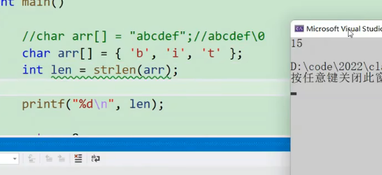

3. 注意函数的返回值是`size_t`，也就是`unsigned int`无符号整型  
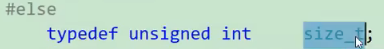
那么对于下图的代码，结果将会是>而不会是<=  
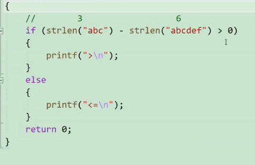
原因：因为strlen的返回值为无符号整型，两个无符号整型，算的结果还是无符号整型，虽然3-6=-3是一个负数，但-3的补码被当成无符号整型来对待的时候，他将会是一个很大的正数。正确的做法要么直接比较二者字符串长度
```c
if(strlen("abc")>strlen("abcdef"))
```
或者直接强转为int。

4. 模拟实现strlen
十分简单，代码如下
```c
//不希望strlen修改arr的内容，用const修饰
unsigned int myStrlen(const char* arr) {
	if(arr==NULL)
		return -1;
	int count = 0;
	char* p = arr;
	while (*p != '\0') {
		count++;
		p++;
	}
	return count;
}
```

### 长度不受限制的字符串函数
#### 2）strcpy函数
函数接口如下：
```c
char * strcpy(char *destination,const char * source)
```
注意点：  
1. 作用：将源头source所指向空间的数据拷贝到destination所指向空间，**包括`\0`**，返回值为目标字符串的指针destination  
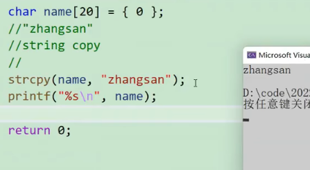

2. 如果原字符串中间有`\0`，那么只会拷贝到\0就结束，后面的不再拷贝。**也就是说strcpy遇到\0就停止拷贝**  
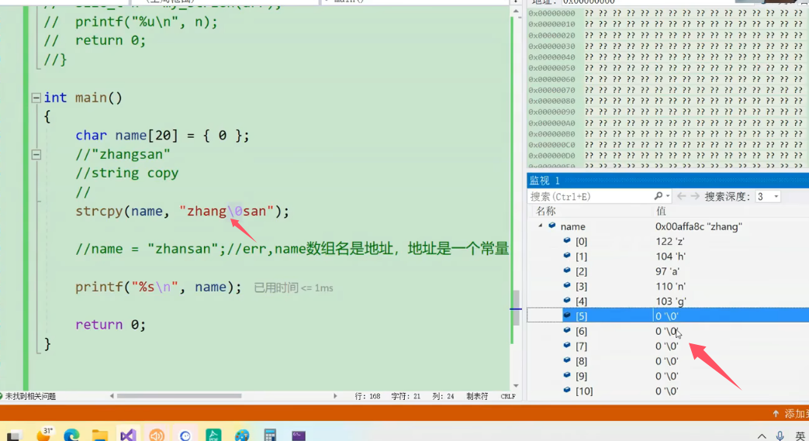

3. 如果源字符串没有`\0`，那么strcpy拷贝完源字符串中的内容之后，再随机拷贝一部分内容，很大可能会造成越界访问  
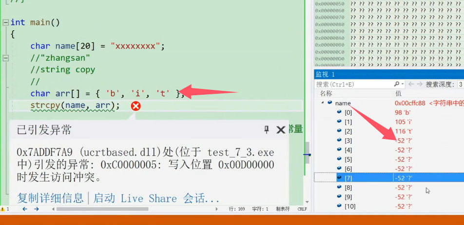

4.目标空间必须足够大，以保证能存放字符串，不然会造成越界访问  
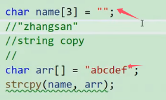

5.目标空间必须可以进行改动  
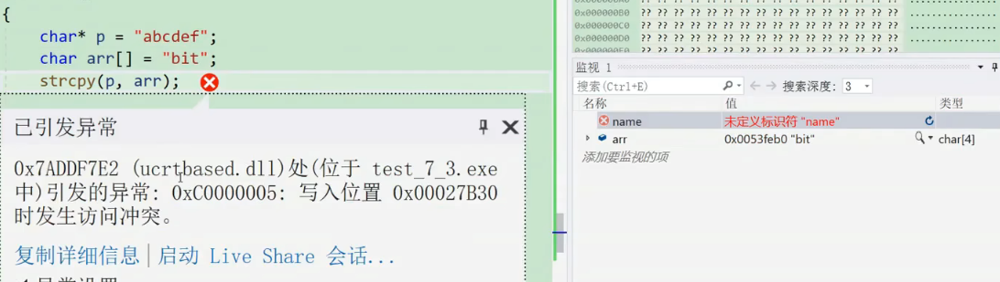
* 上图中目标区域p为字符指针，指向的内容是常量字符串，常量字符串不可修改，所以执strcpy函数是会发生写入访问冲突。如果p时一个字符数组，可以进行改动，此时就可以执行strcpy函数

6.模拟实现strcpy函数
```c
char * myStrcpy(char* destination,const char *source) {
	if(destination==NULL)
		return -1;
	if(source==NULL)
		return -1;
	char* res = destination;
	while (*source != '\0') {
		*destination = *source;
		destination++;
		source++;
	}
	//注意需要包括\0
	*destination = '\0';
	return res;
}
```

更简单的做法：
```c
char * myStrcpy(char* destination,const char *source) {
	if(destination==NULL)
		return -1;
	if(source==NULL)
		return -1;
	char* res = destination;
	//++作用于destination，用于地址++
	//赋值语句的结果是否为0取决于等式右边是否为0，并且先执行赋值语句，再进行判断，所以不用考虑最后\0的特殊情况
	while (*destination++ = *source++) {
		;
	}
	return res;
}
```


#### 3) strcat函数
函数接口如下：
```c
char * strcat(char *destination,const char * source)
```
注意点：  
1. 用法：字符串追加，即源头source所指向空间的数据追加到destination所指向空间数据的末尾,包括`\0`;返回值同样为目标字符串的指针destination

2. 与strcpy同理，源字符串必须要以`\0`结尾；目标空间必须足够大，能够容纳下源字符串的内容；目标空间必须可以进行修改

3. 模拟实现strcat函数
```c
char* myStrcat(char* destination, const char* source) {
	if (destination == NULL)
		return -1;
	if (source == NULL)
		return -1;
	char* res = destination;
	while (*destination != NULL)
		destination++;
	while (*destination++ = *source++) {
		;
	}
	return res;
}
```

4. 如果字符串给自己追加，会进入死循环，原因为在追加的过程中，会破坏掉字符串的\0，这样会无限进行追加，使得程序进入死循环吗，所以尽量避免用strcat函数自己对自己进行追加

#### 4）strcmp函数
首先介绍一个典型的使用错误，按照正常的理解来说，下图程序的代码应该是\==，而不是!=     
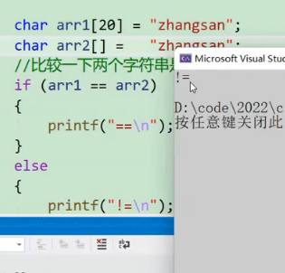
输出!=的原因：arr1和arr2都是数组名，而数组名本质上是数组首元素的地址，也就是两个数组中z的地址。尽管两个数组的内容相同，但是两个数组在内存中肯定创建的是两个不同的空间，地址就必然不相等，所以arr1和arr2不相等。  

我们比较两个字符串是否相等，应该比较的是连两个字符串的内容是否相同，而不是比较两个字符串的地址是否相同，而上图中是在比较来那个个字符串的地址，而不是两个字符串的内容  

而比较两个字符串是否相等，应该使用strcmp函数进行比较
strcmp函数接口具体如下：
```c
int strcmp(const char *str1,const char * str2)
```
注意点：  
1. 此函用于比较两个字符串是否相等。如果第一个字符串小于第二个字符串，那么就返回<0的数字；反之返回大于0的数字；如果两个字符串的内容相同，那么返回
* 如何判断两个字符串的大于小于呢，通过下图来进行讲解   
	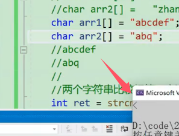  
	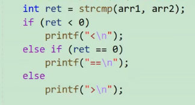
	strcmp的内部实现是一个一个字符进行比较，通过ascii码值来进行比较。也就是说如果str1的字符的ascii值比str2的大，那么就返回大于0的数字，所以图中输出使得是>。**注意：strcmpp是比较的每个字符的ascii码值，跟两个字符串的长度无关**

2. strcmp函数的模拟实现
```c
int  myStrcmp(const char* str1, const char*str2) {
	while (*str1 != NULL || *str2 != NULL) {
		if (*str1 < *str2)
			return -1;
		else if (*str1 > *str2)
			return 1;
		else {
			str1++;
			str2++;
		}
	}
	return 0;
}
```
更简单的实现：利用已经比较出来的ascii码值的大小直接进行返回
```c
int  myStrcmp(const char* str1, const char*str2) {
	assert(str1 &&str2);
	while(*str1==*str2){
		if(*str1=='\0')
			return 0;
		str1++;
		str2++;
	}
	return (*str1-*str2);
}
```

### 长度受限制的字符串函数strncpy、strncat和strncmp
长度受限制的字符串函数相比于不受限制的字符串函数来说更加安全。下面只介绍对应的函数接口，使用规则和注意点同上。
#### 5）strncpy函数
函数接口如下：  
```c
char * strcpy(char *destination,const char * source,size_t num)
```
其中的num是要拷贝的字节数。

如果num要比源字符串的长度要长，那么会用`\0`来进行补充  
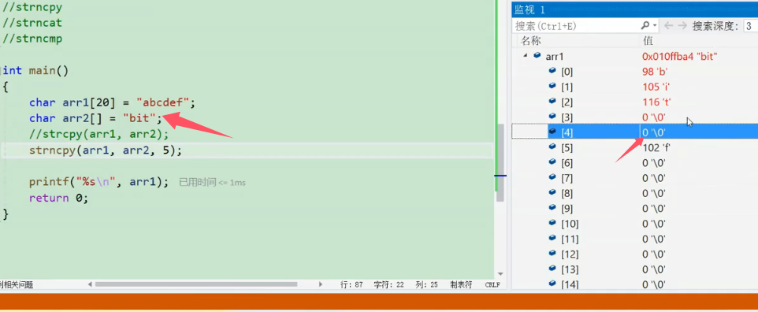
#### 6）strncat函数
函数接口如下：  
```c
char * strcpy(char *destination,const char * source,size_t num)
```
其中的num是要拷贝的字节数。

如果num要比源字符串的长度要短，那么会在追加完之后再补一个`\0`  
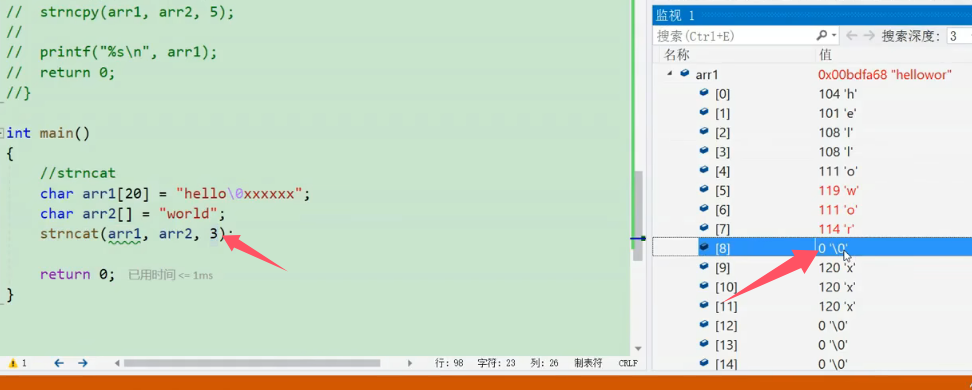
但是，如果num要比源字符串的长度要长，那么只会在追加完源字符串内容，包括`\0`，并不会补充`\0`  
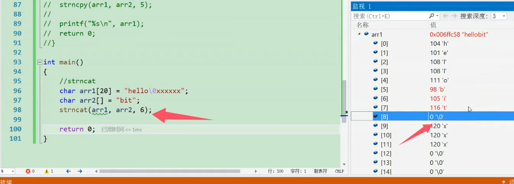

#### 7）strncmp函数
函数接口具体如下：
```c
int strcmp(const char *str1,const char * str2,int num)
```
其中的num是要拷贝的字节数。

*** 

#### 8)strstr函数
函数接口如下所示：
```c
char * strstr(const char *str1,const char *sta2)
```
用法：返回子串str2在主串str1中的第一次出现的位置。如果子串str2不是str1的一部分则返回NULL

具体实现为kmp算法，详情见
[zhelishizhengxiang/code-notes: 根据代码随想录的刷题顺序，自己总结出每一道lectcode的思路、代码和经验](https://github.com/zhelishizhengxiang/code-notes)

*** 

## （二）内存函数
同样地，内存相关的函数也需要包含头文件`string.h`

#### 9）memset函数  
具体见[06函数和变量的存储类型](06函数和变量的存储类型.md)

#### 10）memcpy函数
函数接口如下图所示
```c
void* memcpy(void * destination,const void * source,size_t num)
```
用法：将从source的位置开始向后拷贝num个字节的数据到destination的内存位置。num是要拷贝的字节数。

**strcpy只能用于字符串拷贝，但是memcpy可以用于任何形式的copy，比如整形数组的拷贝等**  
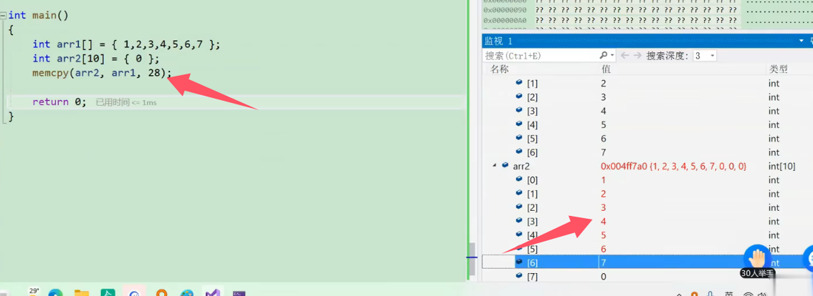

注意点：
1. 此函数遇到`\0`并不会停下来，而是继续复制
2. memcpy负责拷贝两块独立空间中的数据，重叠的内存的拷贝需要使用memmove  
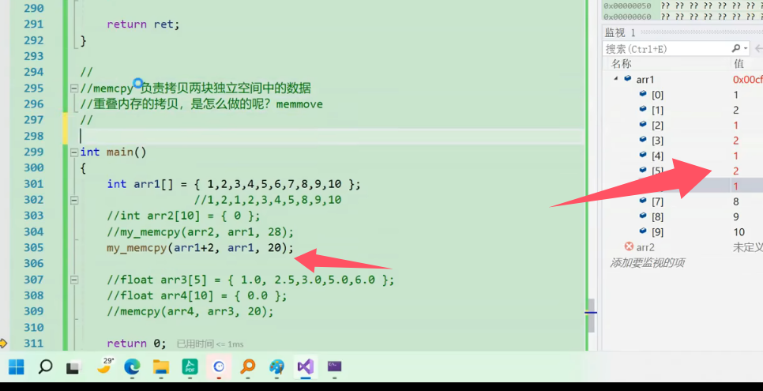
3. 接口参数是void \*的原因是使用泛型指针void*，以适应各种数据类型的拷贝 
4. 模拟实现的思路与strcpy类似，由于是泛型，所以只能一个字节一个字节的进行拷贝。具体如下图  
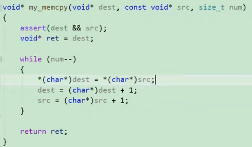

#### 11）memmove函数
函数接口如下图所示：
```c
void* memmove(void * destination,const void * source,size_t num)
```
用于：与memcpy的用法类似，但是memmove适用于实现重叠内存之间的拷贝    
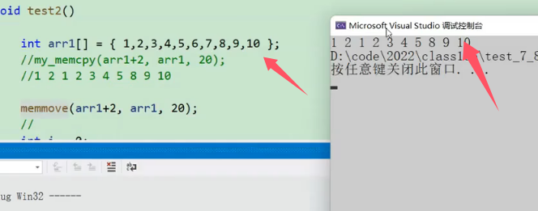
此时是可以进行重叠内存之间的拷贝的


#### 12）memcmp函数
函数接口如下
```c
int * memcmp(const void *ptr1,const void *ptr2,size_t num)
```
用法：比较从ptr1和ptr2开始的num个字节是否相同，返回值
与strcmp相同，但并不是根据ascii码值进行判断，而是一个字节一个字节去比较其值    
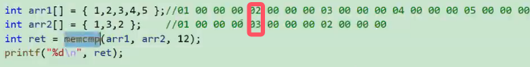
所以上图比较的结果是-1。

区别：与strcmp的区别就是memcmp可以用于任意类型的比较，strcmp只能用于字符串之间的比较
