### 1）动态内存函数
1. 动态内存管理相关函数使用时都需要引头文件`stdlib.h`
2. 动态内存函数操作的申请的空间都是在堆区里面申请的
#### 1.malloc函数
函数接口如下图所示
```c
void * malloc(size_t size)
```
用法：**用于申请一段连续可用的空间，并返回这块空间起始位置的指针**。其中sized为申请空间的字节个数  
* 如果申请成功：则返回一个指向开辟好空间的指针
* 如果申请失败：则返回NULL
* 返回值类型为void*，所以malloc函数本身并不知道开辟空间的类型，具体由使用者来确定（**这几个函数调用时需要强制类型转换成使用的类型**）
最基本的使用方法如下图所示：  
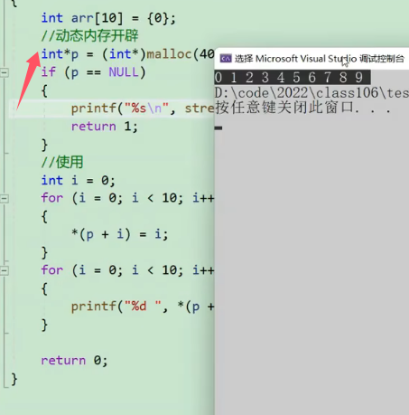

注意：如果程序没有free掉动态申请的内存空间，那么并不意味着动态内存空间就不会被回收。当程序退出的时候，操作系统会自动胡一手动态申请的内存空间。  
但是如果此程序一直不回退出或者一直在执行，而此动态申请的内存空间用过一次过后便不再使用，那么此时就发生了内存泄漏（使用过后的内存空间不释放，其他人也用不了）


#### 2.free函数
`free` 函数是 C 语言中用于释放动态分配内存的函数，其接口和用法如下：
```c
void free(void *ptr);
```
**用法**：  
- `free` 函数用于释放动态分配的内存块，该内存块是通过调用 `malloc`, `calloc`, 或 `realloc` 等动态内存分配函数分配的。
- **参数 `ptr` 是指向要释放的内存块的指针**。
- 调用 `free(ptr)` 会将之前分配的内存块（通过 `malloc`, `calloc`, `realloc` 等函数分配的）释放回系统，以便系统可以重新使用这些内存空间。
- **在释放内存后，应该将指针 `ptr` 设置为 `NULL`，以避免出现悬空指针的情况。**
- 如果p为空指针，那么free(p)相当与什么都没有做


#### 3. calloc函数
函数接口如下图所示：
```c
void *calloc(size_t num, size_t size)
```
功能：
* 申请一块num个大小为size的内存空间，并且还会此空间的每个字节初始化为0
* 与malloc的区别只在于在返回申请空间的指针之前把申请空间的每个字节都初始化为0，其余用法一样

#### 4.realloc函数
动态内存管理的灵活性就体现在realloc。realloc函数可以做到对动态内存大小的调整。

函数接口如下图所示
```c
void *realloc(void * ptr, size_t size)
```
* ptr是要调整的内存空间的起始地址，size是调整后的内存大小，单位是字节
* 返回值是调整之后的内存起始地址
* realloc函数在调整原内存空间大小的情况下，还会将原来内存空间的数据移动到新的空间，然后将原内存空间释放掉，并且值保持不变，具体如下图所示  
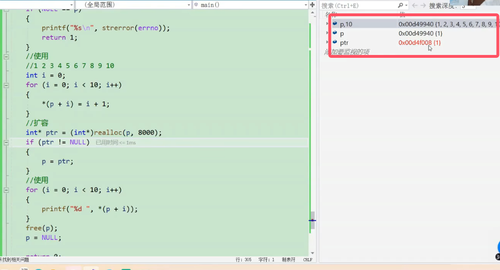
* 一般情况下使用一个新的指针变量来接受调整后的空间地址。因为继续使用原指针变量去接受调整过后的空间的情况下，如果realloc调整失败，那么会返回空指针，这样不仅没有调整空间，还没有办法使用调整之前的空间，
* 所以基于上面，那么需要先用一个新变量去接收，判断其是否为空指针，然后再赋值给原指针变量
基本的使用方法如下图所示：  
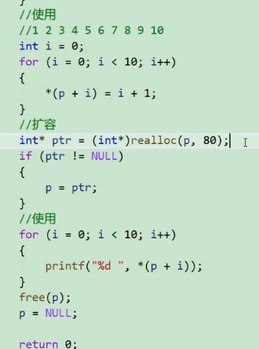  
上图中扩容后打印结果还是1-10，因为realloc函数只可能会移动地址空间，但是对应相对位置的值并不会改变或者清0


### 2）常见动态内存的错误
#### 1.对NULL指针的解引用操作
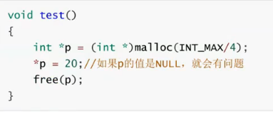
* 图中申请的内存过大，大于电脑可以调配的所有内存间，这样会申请失败，所以返回空指针，这样就会产生对空指针的解引用操作
* 正确的做法是用if语句首先判断是否p为空，再对p解引用操作
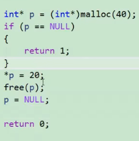

#### 2.对动态开辟空间的越界访问
  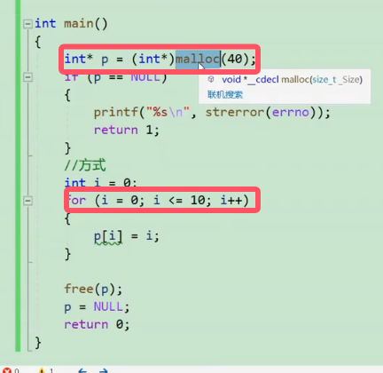

#### 3.对非动态开辟空间使用free释放
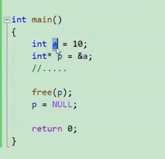
* 图中p指向的空间是栈区的空间，而不是动态内存空间(堆区)，这样执行程序会使程序崩溃

#### 4.使用free释放动态开辟内存的一部分
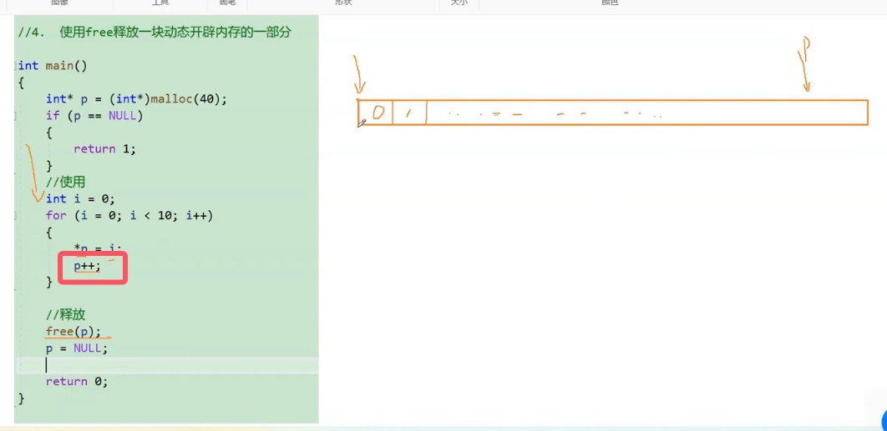
* free函数是无法做到释放动态开辟内存的一部分，只能从动态开辟空间的起始地址开始释放，这样执行程序会崩溃

#### 5. 对同一动态内存空间的重复释放
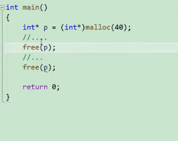
* **避免此类此类情况的发生：在每次free后一定要将p置为NULL**

#### 6.动态开辟内存忘记释放(内存泄漏)

情况一：  
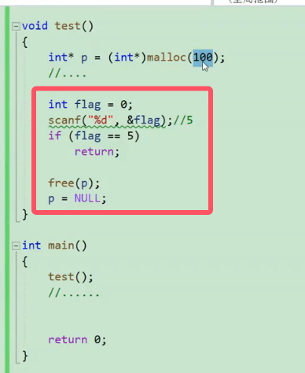

情况二：  
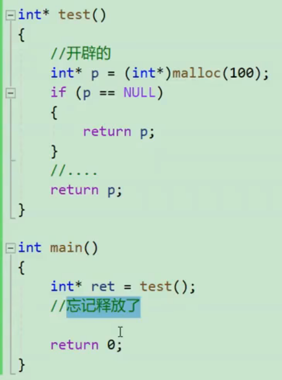

